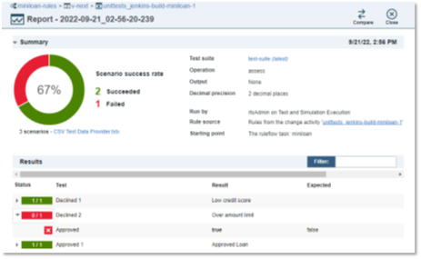

# Setting-up a Jenkins CI/CD pipeline for ODM

This asset provides a documented reference implementation of the steps involved in setting-up a CI/CD pipeline for ODM decision services. It is showcasing different types of interactions between the pipeline and ODM using REST API, a Jenkins script for traditional and OCP deployments, and a detailed demo scenario.

The pipeline used in the example includes the following stages in sequence:

- _Test_, which runs an ODM test suite associated with a custom scenario provider,
- _Auto-review_, which uses the [ODM Transformation Advisor](https://github.com/DecisionsDev/odm-transformation-advisor) (OTA) code base to automatically review the rules for coding standards,
- _Manual review,_ which suspends the pipeline execution and allows the intervention of a human reviewer to perform review tasks in the context of an ODM validation activity,
- _Deploy_, which deploys the decision service to the Rule Execution Server.

There are 2 versions of the script:

- **Local version** : using a locally installed instance of the ODM DC and RES, as well as a local Jenkins server. It is also using a local version, Java SE version of the OTA. The code for the pipeline script assumes an underlying Windows machine but using a Mac or other Linux machine should be as simple as changing the occurrences of the bat() command with sh(). The corresponding script in the Git repo is found [here](https://github.ibm.com/itg-ba/odm-cicd/blob/main/resources/Jenkinsfile-local).
- **OCP version** : using a Jenkins server as well as ODM DC and RES deployed on an OCP cluster. The corresponding script in the Git repo is found [here](https://github.ibm.com/itg-ba/odm-cicd/blob/main/resources/Jenkinsfile-ocp). Note that it currently includes only the _Test_ and _Deploy_ stages of the pipeline.

## Technology stack

- ODM 8.11
- Jenkins 2.346

## Concepts illustrated

- Custom test scenario providers
- Decision Center webhooks
- Jenkins pipeline for ODM DevOps
- Use of Decision Center REST API

[TOC]

# Pipeline structure

The goal of the pipeline is to allow business users, after they have completed an update to a business policy, to initiate a sequence of unit testing, automated and manual rules review, and finally deployment of the decision service. Steps can easily be added or removed by modifying the pipeline script.

Note that the pipeline is working out of artifacts (rule projects, rules, test suite) residing in the Decision Center repository and uses the [Decision Center REST API](https://www.ibm.com/docs/en/odm/8.11.0?topic=reference-decision-center-rest-api). The pipeline implementation would be entirely different if applied on rule projects stored in e.g., a Git repository.

Also note that the script assumes the use of the [ODM Decision Governance Framework](https://www.ibm.com/docs/en/odm/8.11.0?topic=services-managing-changes-decision-governance-framework) (DGF). If using the simple branch mechanism from Decision Center, the script can be very much simplified as it would not require the management (creation, approval) of change and validation activities to perform the different operations. However, the manual review step, which relies on the update event of a DGF validation activity, would have to be implemented differently, i.e. rely on another type of event.

The high-level flow implemented is shown below.


## Unit testing

To facilitate the initiation of the process, the unit testing step uses a custom scenario provider instead of an Excel spreadsheet for the test suite execution.

This allows the business users to skip the step where they have to update the test suite's scenario spreadsheet in Decision Center. Instead, they can just update the source for the scenarios to be tested (in our example, a CSV file), and run the pipeline.

A possible extension would be to have this CSV scenario file captured in a Git repository and the pipeline being triggered whenever a change to the scenario file is committed.

The sequence of actions for the _unit testing_ stage is the following:

1. Create a change activity on which to run the test suite:
  - **PUT /releases/{releaseID}/changeactivity**
2. Retrieve the test suite id:
  - **GET /decisionservices/{decisionServiceId}/testsuites**
3. Invoke the test suite execution:
  - **POST /testsuites/{testSuiteId}/run**
4. Poll the test report for scenario execution completion:
  - **GET /testreports/{testReportId}**
5. Close the change activity:
  - **POST activities/{activityId}/allowapproval**
6. Check for failures or errors in the execution of the test suite, and stop the pipeline accordingly

The corresponding sample code is shown below. Again, this code would get simplified if using simple branches instead of governed releases.
```
stage('Unit Testing') {
    steps {
        echo 'Running unit tests...'
        script {
            //
            // Create an ODM change activity on which tests will be performed.
            //
            def ACTIVITY_NAME = "unittests_${BUILD_TAG}"
            def CA_URL = "${DC_ENDPOINT}/releases/${RL_ID}/changeactivity"
            def CA_CURL = sprintf(PUT, CA_URL)
            def CA_DEF = "{\\\"name\\\": \\\"${ACTIVITY_NAME}\\\", \\\"owner\\\": \\\"${APPROVER}\\\", \\\"targetDate\\\": \\\"2024-10-01T01:00:00.000Z\\\"}"
            def CA_SCRIPT = "${CA_CURL} -d \"${CA_DEF}\" | jq -r \".id\""
            def CA_ID = bat(returnStdout: true, script: CA_SCRIPT).trim()
            if (CA_ID == null) {
                error("Cannot create validation activity ${ACTIVITY_NAME}")
            }
            //
            // Get the test suite id.
            //
            def TEST_SUITE_URL = "\"${DC_ENDPOINT}/decisionservices/${DS_ID}/testsuites?baselineId=${CA_ID}&q=name:${TEST_SUITE_NAME}\""
            def TEST_SUITE_CURL = sprintf(GET, TEST_SUITE_URL)
            echo "Running command ${TEST_SUITE_CURL}"
            def TEST_SUITE_SCRIPT = "${TEST_SUITE_CURL} | jq -r \".elements[0].id\""
            def TEST_SUITE_ID = bat(returnStdout: true, script: TEST_SUITE_SCRIPT).trim()
            //
            // Run the test suite.
            //
            def RUN_TEST_URL = "\"${DC_ENDPOINT}/testsuites/${TEST_SUITE_ID}/run?baselineId=${CA_ID}\""
            def RUN_TEST_SCRIPT = sprintf(POST, RUN_TEST_URL)
            def RUN_TEST_RESULT = bat(returnStdout: true, script: RUN_TEST_SCRIPT).trim()
            def RUN_TEST_RESULT_PROPS = readJSON(text: RUN_TEST_RESULT)
            if ( RUN_TEST_RESULT_PROPS['error'] != null ) {
                error(RUN_TEST_RESULT_PROPS['reason'])
            }
            def TEST_REPORT_ID = RUN_TEST_RESULT_PROPS['id']
            def CHECK_TEST_RESULT_PROPS = null
            retry (60) {
                //
                // Loop on checking for execution completion.
                //
                sleep 10
                def TEST_REPORT_URL = "\"${DC_ENDPOINT}/testreports/${TEST_REPORT_ID}?baselineId=${CA_ID}\""
                def TEST_REPORT_SCRIPT = sprintf(GET, TEST_REPORT_URL)
                def CHECK_TEST_RESULT = bat(returnStdout: true, script: TEST_REPORT_SCRIPT ).trim()
                CHECK_TEST_RESULT_PROPS = readJSON(text: CHECK_TEST_RESULT)
                if ( CHECK_TEST_RESULT_PROPS['status'] != "COMPLETED" ) {
                    error("Unit tests execution did not complete yet. Waiting...")
                }
            }
            //
            // Close the change activity.
            //
            def CLOSE_CA_URL = "\"${DC_ENDPOINT}/activities/${CA_ID}/allowapproval\""
            def CLOSE_CA_SCRIPT = sprintf(POST, CLOSE_CA_URL)
            bat(returnStdout: true, script: CLOSE_CA_SCRIPT)
            //
            // Assess the result of the tests
            //
            if ( CHECK_TEST_RESULT_PROPS['status'] != "COMPLETED" ) {
                error("Unit tests execution timeout.")
            }
            if ( CHECK_TEST_RESULT_PROPS['failures'] != 0 || CHECK_TEST_RESULT_PROPS['errors'] != 0) {
                error("Unit tests did not pass.")
            }
        }
    }
}
```

## Auto review

The ODM Transformation Advisor (OTA) asset allow to define coding conventions that should be validated against the elements of an ODM project decision service. These conventions can take the form of Java code validations as well as ODM rules applied to the ODM meta-model. After validating a decision service, a detailed report of possible issues is generated.

The goal of this stage is to apply the OTA on the target decision service of the pipeline and stop the pipeline execution if issues are detected by this auto-review mechanism.

The sequence of actions for the _auto-review_ stage is the following:

1. Launch the OTA executable on the target decision service
2. Check for issues detected by the auto-review, and stop the pipeline accordingly

The corresponding sample code is shown below.

```
stage('Auto-review') {
    steps {
        echo 'Auto-reviewing project rules...'
        script {
            def OTA_REPORT = "${OTA_DIR}/output/${BUILD_TAG}"
            def OTA_COMMAND = "${ANT_DIR}/bin/ant -f ${OTA_DIR}/ota.xml run-ota -Dota.report=${OTA_REPORT} -Dota.projects=${PROJECT_NAME}/${RELEASE_NAME}"
            bat(script: OTA_COMMAND)
            REVIEW_RESULT_PROPS = readJSON(file: "${OTA_REPORT}.json")
            echo "Auto-review results are available in file ${OTA_REPORT}.html"
            if ( REVIEW_RESULT_PROPS['issues'] > 0 ) {
                error("Auto-review did not pass.")
            }
        }
    }
}
```

## Manual review

The manual review stage provides the opportunity to suspend the pipeline execution if a manual review of the changed artifacts is required and automatically resume the execution of the pipeline when the reviewer manually approves or rejects the changes.

The handovers between the pipeline and the manual activity are based on the use of _webhooks_, both on the Jenkins and the ODM side. Decision Center allows the creation of webhooks to notify external applications of various events such as a rule being created, a branch being updated, etc. (see this [doc page](https://www.ibm.com/docs/en/odm/8.11.0?topic=customizing-setting-up-webhook-notifications)).

In our case, we will use the `ActivityUpdated` event to notify the pipeline when the manual review is completed. The sequence of actions for the _auto-review_ stage is the following:

1. Create a unique Jenkins endpoint (using a name specific to the build instance) to listen to the ODM event.
2. Create the Decision Center webhook to invoke this endpoint:
  - **PUT /webhook/notify**
3. Create a validation activity to allow the manual review activities:
  - **PUT /releases/{releaseId}/validationactivity**
4. On the pipeline side, wait for a notification event from ODM
5. Parse the event JSON data to make sure it is an `ActivityUpdated` event and retrieve the status provider by the approver.
6. Continue or stop the pipeline based on the status (`ApprovedChanges` or `RejectedChanges`)

The corresponding sample code is shown below.

```
stage('Manual Review') {
    steps {
        echo 'Start manual review...'
        script {
            //
            // Create Jenkins webhook using project/release/build identifier
            //
            def HOOK_NAME = "${PROJECT_NAME}_${RELEASE_NAME}_${BUILD_TAG}"
            def HOOK = registerWebhook(token: "${HOOK_NAME}")
            echo "Registered Jenkins webhook to ${HOOK.url}"
            //
            // Create DC webhook to post to the Jenkins webhook
            //
            def DC_WH_URL = "${DC_ENDPOINT}/webhook/notify?url=${HOOK.url}"
            def DC_WH_CURL = sprintf(PUT, DC_WH_URL)
            def DC_WH_SCRIPT = "${DC_WH_CURL} | jq -r \".id\""
            def DC_WH_ID = bat(returnStdout: true, script: DC_WH_SCRIPT).trim()
            echo "Created DC webhook ${DC_WH_ID}"
            //
            // Create an ODM validation activity to perform manual review
            //
            def ACTIVITY_NAME = "manualreview_${BUILD_TAG}"
            def DC_VA_URL = "${DC_ENDPOINT}/releases/${RL_ID}/validationactivity"
            def DC_VA_CURL = sprintf(PUT, DC_VA_URL)
            def VA_DEF = "{\\\"approversNames\\\": [\\\"${APPROVER}\\\"], \\\"name\\\": \\\"${ACTIVITY_NAME}\\\", \\\"owner\\\": \\\"${APPROVER}\\\", \\\"targetDate\\\": \\\"2024-10-01T01:00:00.000Z\\\"}"
            def DC_VA_SCRIPT = "${DC_VA_CURL} -d \"${VA_DEF}\" | jq -r \".id\""
            def DC_VA_ID = bat(returnStdout: true, script: DC_VA_SCRIPT).trim()
            if (DC_VA_ID == null) {
                error("Cannot create validation activity ${ACTIVITY_NAME}")
            }
            echo "Created validation activity named ${ACTIVITY_NAME} with id ${DC_VA_ID}"
            //
            // Waiting for reviewer to complete review and approve changes
            //
            def CONTINUE = true
            while (CONTINUE) {
                data = waitForWebhook HOOK
                UPDATE_SCRIPT = "@echo ${data} | jq -r \"select(.type == \\\"ActivityUpdated\\\") | .content[0] | select(.name == \\\"${ACTIVITY_NAME}\\\") | .approvers[0].status\""
                UPDATE = bat(returnStdout: true, script: UPDATE_SCRIPT).trim()
                echo "Update value ${UPDATE}"
                if (UPDATE.equals("ApprovedChanges") || UPDATE.equals("RejectedChanges")) {
                    CONTINUE = false
                    //
                    // Clean-up the DC webhook
                    //
                    def DC_WH_DELETE_URL = "${DC_ENDPOINT}/webhooks/${DC_WH_ID}/notify"
                    def DC_WH_DELETE_CURL = sprintf(DELETE, DC_WH_DELETE_URL)
                    echo DC_WH_DELETE_CURL
                    bat(DC_WH_DELETE_CURL)
                    echo "Deleted DC webhook ${DC_WH_ID}"
                    //
                    // Stop on rejected changes
                    //
                    if (UPDATE.equals("RejectedChanges")) {
                        error("Manual review did not pass")
                    }
                }
            }
            echo "Manual review completed"
        }
    }
}
```

## Deployment

The deployment stage is a straightforward deployment to a Rule Execution Server through the Decision Center REST API. The sequence of actions for the _deploy_ stage is the following:

1. Get the target deployment configuration:
  - **GET /decisionservices/{decisionServiceId}/deployments**
2. Build and deploy the RuleApp corresponding to the deployment configuration:
  - **PUT /deployments/{deploymentId}/deploy**

The corresponding sample code is shown below.
```
stage('Deploy') {
    steps {
        echo 'Deploying to RES...'
        script {
            //
            // Get the deployment id
            //
            def DEPLOYMENT_URL = "\"${DC_ENDPOINT}/decisionservices/${DS_ID}/deployments?baselineId=${RL_ID}&q=name:${DEPLOYMENT_NAME}\""
            def DEPLOYMENT_CURL = sprintf(GET, DEPLOYMENT_URL)
            def DEPLOYMENT_SCRIPT = "${DEPLOYMENT_CURL} | jq -r \".elements[0].id\""
            DEPLOYMENT_ID = bat(returnStdout: true, script: DEPLOYMENT_SCRIPT).trim()

            def DP_URL = "${DC_ENDPOINT}/deployments/${DEPLOYMENT_ID}/deploy"
            def DP_SCRIPT = sprintf(POST, DP_URL)
            def DEPLOY_RESULT = bat(returnStdout: true, script: DP_SCRIPT).trim()
            def DEPLOY_RESULT_PROPS = readJSON(text: DEPLOY_RESULT)
            if ( DEPLOY_RESULT_PROPS['status'] != "COMPLETED" ) {
                error("Deployment failed.")
            }
        }
    }
}
```

# Demo

## Setting up the demo

Get the demo content from the [https://github.ibm.com/itg-ba/odm-cicd](https://github.ibm.com/itg-ba/odm-cicd) Git repo and go through the 3 steps below.

And yes, these steps could be fully scripted…

### Install resources

_This step only applies for a local deployment only_, using test scenario data on a file system and a Java SE version of OTA.

1. Create a working folder for running the demo. In the rest of this section, we will use the `C:\odm-cicd` folder and refer to it as `<installdir>`.
2. Copy the `odm-cicd/ota-driver/pkg/ota` folder to `<installdir>`.
3. Copy the `odm-cicd/resources/TestData.csv` file to `<installdir>`.

### Create Jenkins pipeline

1. Use your Jenkins instance to create a pipeline named build-miniloan.


1. Copy the content of the [odm-cicd/resources/Jenkinsfile-local](https://github.ibm.com/itg-ba/odm-cicd/blob/main/resources/Jenkinsfile-local) (for a local install) or [odm-cicd/resources/Jenkinsfile-ocp](https://github.ibm.com/itg-ba/odm-cicd/blob/main/resources/Jenkinsfile-ocp) (for an install on OpenShift) file to the pipeline script text box and save the pipeline.


- Note that the first time you will run the script, you will see the message below in the console output. Click on the link in that message to get to the Script Approval page and approve the use of the method.
```
[Pipeline] { (hide)

Scripts not permitted to use staticMethod org.codehaus.groovy.runtime.DefaultGroovyMethods sprintf java.lang.Object java.lang.String java.lang.Object. Administrators can decide whether to approve or reject this signature.

[Pipeline] }
```


- Also note that, for the manual step, you will need this Jenkins plugin to be installed: [https://plugins.jenkins.io/webhook-step/](https://plugins.jenkins.io/webhook-step/)

### Import and prepare ODM decision service

#### Import decision service

1. Import the `odm-cicd/resources/miniloan-rules [main].zip` decision service archive in ODM.


#### Point to test scenario's location

The ODM test suite uses a custom provider that sources the test scenarios from a file. The file can be sourced from a local disk or a URL, and the location needs to be specified in the test suite definition.

1. Navigate to the test suite artifact named test-suite in the main branch, click the edit button, and scroll to the `Scenarios` section:


1. In the `Dataset name` text field, enter the name of the file from which the scenario should be sourced, using a URL format. For example:
  - _For a local file_: `file:///c:/odm-cicd/TestData.csv`
  - _For a network file_: `https://raw.githubusercontent.com/cp4ba-ce/odm-cicd/main/TestData.csv`

#### Create release

1. Click on the `Releases` tab and turn on the `Use Decision Governance Framework`.


1. Create a new release called `v-next`. Take care to specify a due date that is after the due date of the activities defined in the Jenkinsfile script.


## Running the demo

Select the `build-miniloan` pipeline on the Jenkins dashboard and click Build Now.


### Unit testing

The build starts and stops in error at the `Unit Testing` stage.


You can look at the test suite report in the `unittests_jenkins-build-miniloan-1` activity that was created.



The issue comes from the `maximum amount` rule for which the amount should be set at $1M instead of $10M.

Create a change activity named, e.g., `Fix for unit tests` to fix the rule as shown below.


When done, proceed to approve the change activity.


Restart the build.

### Auto review

This time, the build stops at the `Auto-review` stage.


You can see the issues that have been detected by opening the `Jenkins-build-miniloan-2.html` file found in the `<installdir>/ota/output` folder.


Three issues have been detected, one on a property for the `maximum amount` rule and two on the ruleflow.


Create a change activity named, e.g., `Fix for auto review`, to address these issues.

The first issue involves a wrong value for the `sampling` tag on the `maximum amount` rule. It is raised by this validation rule:


To fix it, change the sampling tag value of the rule to RUS.


The other two issues are cause by the wrong algorithm being used by the eligibility rule task. They are raised by these validation rules:


To fix these issues, change the `eligibility` algorithm to `Fastpath`, then approve the change activity.


Run the pipeline again.

### Manual review

This time, the pipeline gets suspended on the `Manual Review` stage.


A validation activity named `manualreview_${BUILD_TAG}` (in this instance, `manualreview_jenkins-build-miniloan-3`) has been created by the pipeline to allow a manual review activity on the rules, which can include running additional test scenarios, for example.


When the review has been completed, approve the activity. This will trigger an event that is posted to the pipeline through the ODM webhook and allow the pipeline to continue to the `Deploy` stage.


In the end, the set of activities that have been complete should be the following, with each activity keeping track of the steps that have been performed through the pipeline execution.


